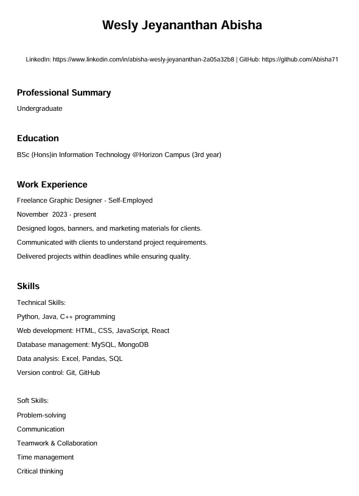
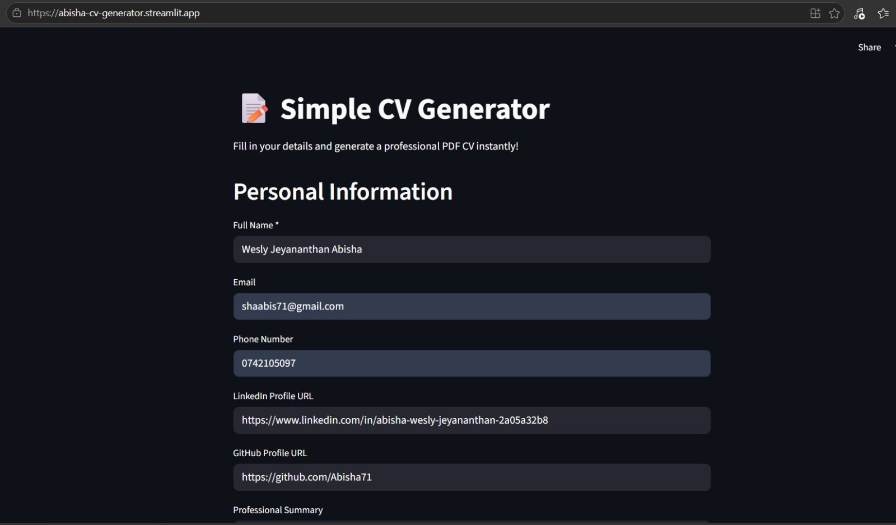
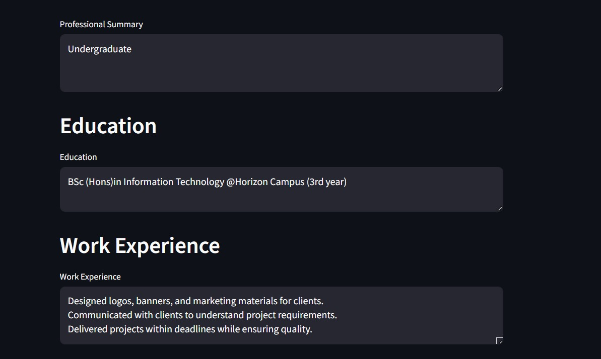
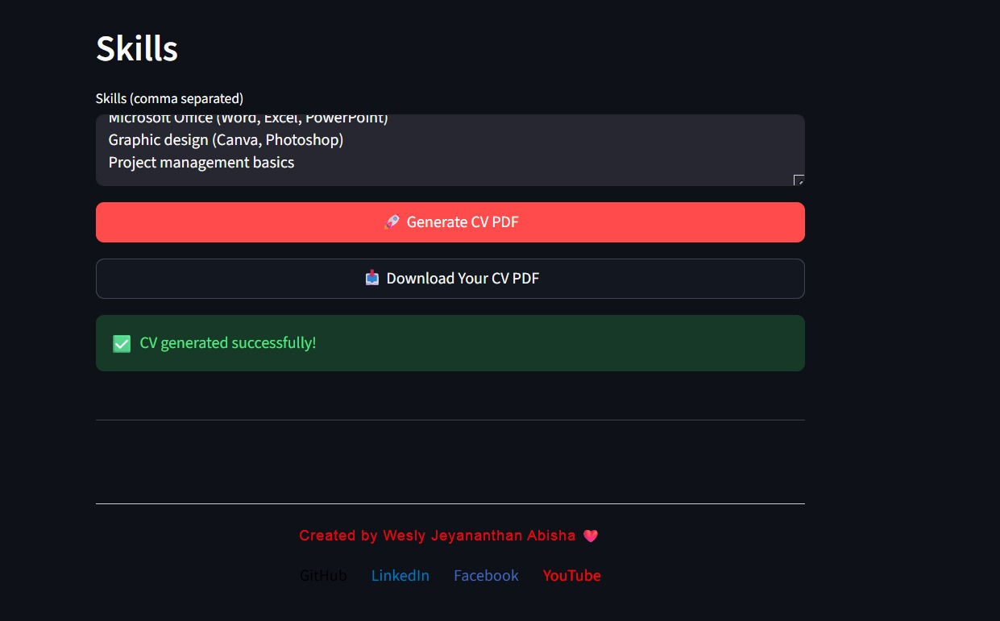

# 📝 Simple CV Generator

A clean and user-friendly web application built with **Streamlit** that allows you to quickly create a professional CV / Resume and download it as a **PDF** file with just one click.



## ✨ Features

- Personal Information (Name, Email, Phone, LinkedIn, GitHub)
- Professional Summary section
- Education details
- Work Experience
- Skills (comma separated)
- Instant PDF generation and download
- Clean and simple user interface

## 🛠️ Technologies Used

- Python
- Streamlit
- FPDF (for PDF generation)

## 🚀 How to Run Locally

1. Clone the repository:
   ```bash
   git clone https://github.com/Abisha71/cv-generator.git
   cd cv-generator

2. Install dependencies:Bash
   ```bash
   pip install -r requirements.txt
4. Run the app
    ```bash
    streamlit run app.py

  ##  📸 Screenshots



  ## 🚀 Live Demo
https://abisha-cv-generator.streamlit.app/
  ## 👨‍💻 Created By
Wesly Jeyananthan Abisha

